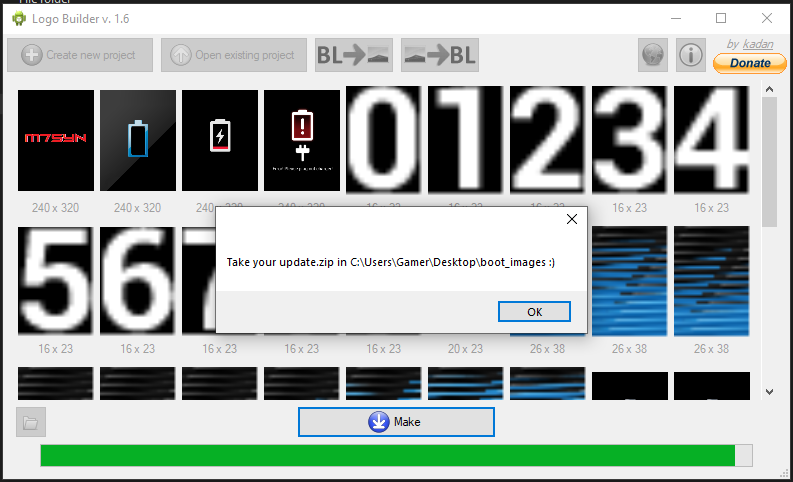

# Rooting HIROYASU HI-B8 Zello PoC FM Walkie Talkie


Index:

* [About Radio](#About-Radio)
* [Installation](#MTK-Client-Installation)
* [Dumping the Boot](#Dumping-the-Boot)
* [Installing Magisk](#Installing-Magisk)
* [Erasing Userdata & Metadata](#Erasing-Userdata-&-Metadata)
* [Writing the Custom Patched Bootrom](#Writing-the-Custom-Patched-Bootrom) 
* [Unlocking The Bootloader](#Unlocking-The-Bootloader)
* [Enabling Root Access](#Enabling-Root-Access)
* [Create Custom Boot Animation (Optional)](#Create-Custom-Boot-Animation-(Optional))
* [Overwrite The Boot & Shudown Animations (Optional)](Overwrite-The-Boot-&-Shudown-Animations-(Optional))
* [Overwrite The Boot / Shudown Audio (Optional)](#Overwrite-The-Boot-/-Shudown-Audio-(Optional))
* [Replacing The Boot Splash images (Optional)](Replacing-The-Boot-Splash-images-(Optional))
* [Internals](#Internals)
* [Resources](#Resources)
* [Credits](#Credits)


# About Radio 

The HIROYASU HI-B8 is a multi-functional device that integrates features typically found in smartphones, walkie-talkies, GPS trackers, and FM radios. Designed to support both professional and recreational communication needs, 
it combines robust connectivity options with a compact and durable design.

The device supports 2G, 3G, and 4G LTE networks, providing reliable voice and data communication, including in areas with limited coverage. It is equipped with Zello Push-to-Talk (PoC) functionality, which facilitates instant
communication across networks, and also includes an FM radio for traditional broadcast use.

The HI-B8 runs on the Android 9.0 operating system, offering access to a wide range of applications and customization options. Its 2.4-inch touchscreen interface supports ease of use in various environments. 
With 2GB of RAM and 16GB of internal storage, the device provides sufficient capacity for essential applications and files.

Integrated GPS functionality enables location tracking, navigation, and coordinate sharing, making it suitable for tasks requiring geolocation. A voice recording feature is included for capturing audio notes, conversations, 
or other critical audio data.

The device is engineered to be durable, supporting use in challenging environments such as construction sites, outdoor expeditions, or industrial settings. 
Its compact design and combination of communication tools make it a practical choice for users requiring a versatile communication device.

# MTK Client Installation

Note: most of this guide taken from https://github.com/bkerler/mtkclient?tab=readme-ov-file#windows with a few minor
changes such as i had problems with installing python modules due to a long path problem in windows 10, which was resolved
using a registry edit.

Install Winfsp (for fuse)
   Download and [install](https://winfsp.dev/rel/)


Download the latest MTK Client and [install](https://github.com/bkerler/mtkclient/archive/refs/heads/main.zip) unzip and navigate into its path with command prompt, Then install the tools requirements.

```
   pip3 install -r requirements.txt

```

[Long Path Error With Pip](https://learn.microsoft.com/en-us/windows/win32/fileio/maximum-file-path-limitation?tabs=registry#enable-long-paths-in-windows-10-version-1607-and-later):


   Fix: Create a file called Long-pathfix.reg and place the following in to the file.

   ```
   Windows Registry Editor Version 5.00

   [HKEY_LOCAL_MACHINE\SYSTEM\CurrentControlSet\Control\FileSystem]
   "LongPathsEnabled"=dword:00000001
   ```

   Then double click on the file and allow it to install. Close Command Prompt
   and Reopen it and retry installing the requirements.txt


Any other compiling errors try the following: 

Download and Install the Build Tools:
   Go to the Visual Studio Build [Tools](https://visualstudio.microsoft.com/visual-cpp-build-tools) page.
   Download the installer and run it.

Select the Necessary Workloads:
   In the installer, select the "Desktop development with C++" workload.
   Ensure that the "MSVC v142 - VS 2019 C++ x64/x86 build tools" (or later) component is selected.
   You can also check "Windows 10 SDK" if it’s not already selected. - Unselect Windows 11 Not Required

Complete the Installation:

   Click on the "Install" button to begin the installation.
   Follow the prompts to complete the installation.
   Restart your computer if required.


download usbdk installer from [here](https://github.com/daynix/UsbDk/releases/) and install it. This should 
be it for requirements.


# Dumping the Boot

As explained by the intructions on the original README that comes with Mtk Client we need to first ensure we can dump 
the boot loader this can be done with the following commands and also displays the output from the targeted device.


Please Note: In the example the instructions produce the following text:


```

Port - Hint:

Power off the phone before connecting.
For brom mode, press and hold vol up, vol dwn, or all hw buttons and connect usb.
For preloader mode, don't press any hw button and connect usb.
If it is already connected and on, hold power for 10 seconds to reset.

```


In this case its not fully true we need to perform the following steps:

* Power Off The Radio With A USB Cabled Left Plugged Into the radio but not the laptop end.
Remove The Battery. 

* Reconnect The Battery And With The 2 Side Buttons Below The Main PTT Button Held Down
Plugin The Radio. When MTK Client Commands Are Running This Should Get Detected.

If It Fails Just Redo The Whole Process, Please Note it took a few times to get it working
with the commands so if it does not get detected don't panic just keep trying.

Finally, This will need to be reproduced for all the commands used below until you
have completed the process of rooting the radio.

Below Is a Example of Downloading the Bootloader to the local computer as boot.bin:


```
C:\Users\Gamer\Desktop\mtkclient-main\mtkclient-main>python3 mtk.py r boot boot.bin
MTK Flash/Exploit Client Public V2.0.1 (c) B.Kerler 2018-2024

Preloader - Status: Waiting for PreLoader VCOM, please reconnect mobile to brom mode

Port - Hint:

Power off the phone before connecting.
For brom mode, press and hold vol up, vol dwn, or all hw buttons and connect usb.
For preloader mode, don't press any hw button and connect usb.
If it is already connected and on, hold power for 10 seconds to reset.


...........

Port - Hint:

Power off the phone before connecting.
For brom mode, press and hold vol up, vol dwn, or all hw buttons and connect usb.
For preloader mode, don't press any hw button and connect usb.
If it is already connected and on, hold power for 10 seconds to reset.


.........Port - Device detected :)
Preloader -     CPU:                    MT6739/MT6731/MT8765()
Preloader -     HW version:             0x0
Preloader -     WDT:                    0x10007000
Preloader -     Uart:                   0x11002000
Preloader -     Brom payload addr:      0x100a00
Preloader -     DA payload addr:        0x201000
Preloader -     CQ_DMA addr:            0x10212000
Preloader -     Var1:                   0xb4
Preloader - Disabling Watchdog...
Preloader - HW code:                    0x699
Preloader - Target config:              0x0
Preloader -     SBC enabled:            False
Preloader -     SLA enabled:            False
Preloader -     DAA enabled:            False
Preloader -     SWJTAG enabled:         False
Preloader -     EPP_PARAM at 0x600 after EMMC_BOOT/SDMMC_BOOT:  False
Preloader -     Root cert required:     False
Preloader -     Mem read auth:          False
Preloader -     Mem write auth:         False
Preloader -     Cmd 0xC8 blocked:       False
Preloader - Get Target info
Preloader -     HW subcode:             0x8a00
Preloader -     HW Ver:                 0xcb00
Preloader -     SW Ver:                 0x2
Preloader - ME_ID:                      8C9061A2190D6F2C543FF335D358DBB6
Preloader - SOC_ID:                     4A13B658562E8689A847DCA687CFE3C339F3C1866DABBF304FFCD5EEC4CF47D4
DaHandler - Device is unprotected.
DaHandler - Device is in Preloader-Mode.
DAXFlash - Uploading xflash stage 1 from MTK_DA_V5.bin
XFlashExt - Patching da1 ...
Mtk - Patched "Patched loader msg" in preloader
Mtk - Patched "hash_check" in preloader
Mtk - Patched "Patched loader msg" in preloader
Mtk - Patched "get_vfy_policy" in preloader
XFlashExt - Patching da2 ...
XFlashExt - Security check patched
XFlashExt - DA version anti-rollback patched
XFlashExt - SBC patched to be disabled
XFlashExt - Register read/write not allowed patched
DAXFlash - Successfully uploaded stage 1, jumping ..
Preloader - Jumping to 0x200000
Preloader - Jumping to 0x200000: ok.
DAXFlash - Successfully received DA sync
DAXFlash - Uploading stage 2...
DAXFlash - Upload data was accepted. Jumping to stage 2...
DAXFlash - Boot to succeeded.
DAXFlash - Successfully uploaded stage 2
DAXFlash - DA SLA is disabled
DAXFlash - EMMC FWVer:      0x0
DAXFlash - EMMC ID:         QE63MB
DAXFlash - EMMC CID:        150100514536334d4203aba6f2a5954b
DAXFlash - EMMC Boot1 Size: 0x400000
DAXFlash - EMMC Boot2 Size: 0x400000
DAXFlash - EMMC GP1 Size:   0x0
DAXFlash - EMMC GP2 Size:   0x0
DAXFlash - EMMC GP3 Size:   0x0
DAXFlash - EMMC GP4 Size:   0x0
DAXFlash - EMMC RPMB Size:  0x400000
DAXFlash - EMMC USER Size:  0x3a3e00000
DAXFlash - HW-CODE         : 0x699
DAXFlash - HWSUB-CODE      : 0x8A00
DAXFlash - HW-VERSION      : 0xCB00
DAXFlash - SW-VERSION      : 0x2
DAXFlash - CHIP-EVOLUTION  : 0x0
DAXFlash - DA-VERSION      : 1.0
DAXFlash - Extensions were accepted. Jumping to extensions...
DAXFlash - Boot to succeeded.
DAXFlash - DA Extensions successfully added
DaHandler - Requesting available partitions ....
DaHandler - Dumping partition "boot"
Progress: |██████████| 100.0% Read (0xC000/0xC000, ) 0.00 MB/s00 MB/s
DaHandler - Dumped sector 553216 with sector count 49152 as boot.bin.
```

# Installing Magisk

When the bootloader been succesfully downloaded to the local computer we next need to install the Magisk on the radio 
to continue the proccess of patching the bootloader. 

Please note this cannot be completed from a factory device until you have navigated to the phone dial pad,
then entering the follow sequence ```*#13579*#``` upon completed it should flash up at the bottom of the dashbaord "apps can be installed". 

If you have done this prior you may have just reverted the settings for this, which is not a problem as it works like a swich by using the 
key codes you can enable or disable app installation access. Although if this process is not completed Installing Magisk Will Fail.

Upon completion of unlocking the app installation procces we then need to download the latest Magisk [APK file](https://github.com/topjohnwu/Magisk/releases/latest)

Once Magisk app is downloaded a few more settings settings need to take place before proceeding the rest of the steps such as enabling OEM unlocking and USB Debugging. This will allow us to then send files and perform other tasks via commandline "adb" on the radio.


This can be be achived by proceeding with the following on the radio its self.

Enable Developer Mode:

   * Navigate Settings/About Followed By phone/Version, Tap 7x on build number

OEM Unlock (Possibly Not Needed)

   * Navigate To Settings/Additional settings/Developer options, enable "OEM unlock"

USB Debugging:

   * Navigate To Settings/Additional settings/Developer options, enable USB Debugging"


Upon completion of the settings changes required for installing Masgisk and acess to the device over USB its
now possible to remotly install the apk file following the below commands.


Install magisk apk

```
adb install app-release.apk
```

if not already done so accept certificate prompt on the radios screen to allow adb connection.

Next we need to Upload boot file that was downloaded form the radio back to the radio in the following directory /sdcard/Download
This can again be done with the adb.


```
adb push boot.img /sdcard/Download
```

Up on completion of the upload to the radio. we now need to 
pick up the device and Start magisk app and navigate 
to the file manager then find the a app called app-release.apk and tap on it to Install. 

Once the app is installed we need to open it and select the boot.bin file we have uploaded prior.
This will then start the patching process as displayed in the below screenshot.


Now that Magisk has patched the boot file we need to download it back to the host computer
and move it back into the mtk client directory as boot.patched for command simplicity.

```
adb pull /sdcard/Download/[displayed magisk patched boot filename here]

mv [displayed magisk patched boot filename here] boot.patched

```

# Erase Userdata & Metadata 

Note: This will remove all apps that are not default to the rom so if you installed additional 
apps you will loose them so ensure you have them backedup.

```
C:\Users\Gamer\Desktop\mtkclient-main\mtkclient-main>python3 mtk.py e userdata,metadata
MTK Flash/Exploit Client Public V2.0.1 (c) B.Kerler 2018-2024

Preloader - Status: Waiting for PreLoader VCOM, please reconnect mobile to brom mode

Port - Hint:

Power off the phone before connecting.
For brom mode, press and hold vol up, vol dwn, or all hw buttons and connect usb.
For preloader mode, don't press any hw button and connect usb.
If it is already connected and on, hold power for 10 seconds to reset.


...........

Port - Hint:

Power off the phone before connecting.
For brom mode, press and hold vol up, vol dwn, or all hw buttons and connect usb.
For preloader mode, don't press any hw button and connect usb.
If it is already connected and on, hold power for 10 seconds to reset.


.Port - Device detected :)
Preloader -     CPU:                    MT6739/MT6731/MT8765()
Preloader -     HW version:             0x0
Preloader -     WDT:                    0x10007000
Preloader -     Uart:                   0x11002000
Preloader -     Brom payload addr:      0x100a00
Preloader -     DA payload addr:        0x201000
Preloader -     CQ_DMA addr:            0x10212000
Preloader -     Var1:                   0xb4
Preloader - Disabling Watchdog...
Preloader - HW code:                    0x699
Preloader - Target config:              0x0
Preloader -     SBC enabled:            False
Preloader -     SLA enabled:            False
Preloader -     DAA enabled:            False
Preloader -     SWJTAG enabled:         False
Preloader -     EPP_PARAM at 0x600 after EMMC_BOOT/SDMMC_BOOT:  False
Preloader -     Root cert required:     False
Preloader -     Mem read auth:          False
Preloader -     Mem write auth:         False
Preloader -     Cmd 0xC8 blocked:       False
Preloader - Get Target info
Preloader -     HW subcode:             0x8a00
Preloader -     HW Ver:                 0xcb00
Preloader -     SW Ver:                 0x2
Preloader - ME_ID:                      8C9061A2190D6F2C543FF335D358DBB6
Preloader - SOC_ID:                     4A13B658562E8689A847DCA687CFE3C339F3C1866DABBF304FFCD5EEC4CF47D4
DaHandler - Device is unprotected.
DaHandler - Device is in Preloader-Mode.
DAXFlash - Uploading xflash stage 1 from MTK_DA_V5.bin
XFlashExt - Patching da1 ...
Mtk - Patched "Patched loader msg" in preloader
Mtk - Patched "hash_check" in preloader
Mtk - Patched "Patched loader msg" in preloader
Mtk - Patched "get_vfy_policy" in preloader
XFlashExt - Patching da2 ...
XFlashExt - Security check patched
XFlashExt - DA version anti-rollback patched
XFlashExt - SBC patched to be disabled
XFlashExt - Register read/write not allowed patched
DAXFlash - Successfully uploaded stage 1, jumping ..
Preloader - Jumping to 0x200000
Preloader - Jumping to 0x200000: ok.
DAXFlash - Successfully received DA sync
DAXFlash - Uploading stage 2...
DAXFlash - Upload data was accepted. Jumping to stage 2...
DAXFlash - Boot to succeeded.
DAXFlash - Successfully uploaded stage 2
DAXFlash - DA SLA is disabled
DAXFlash - EMMC FWVer:      0x0
DAXFlash - EMMC ID:         QE63MB
DAXFlash - EMMC CID:        150100514536334d4203aba6f2a5954b
DAXFlash - EMMC Boot1 Size: 0x400000
DAXFlash - EMMC Boot2 Size: 0x400000
DAXFlash - EMMC GP1 Size:   0x0
DAXFlash - EMMC GP2 Size:   0x0
DAXFlash - EMMC GP3 Size:   0x0
DAXFlash - EMMC GP4 Size:   0x0
DAXFlash - EMMC RPMB Size:  0x400000
DAXFlash - EMMC USER Size:  0x3a3e00000
DAXFlash - HW-CODE         : 0x699
DAXFlash - HWSUB-CODE      : 0x8A00
DAXFlash - HW-VERSION      : 0xCB00
DAXFlash - SW-VERSION      : 0x2
DAXFlash - CHIP-EVOLUTION  : 0x0
DAXFlash - DA-VERSION      : 1.0
DAXFlash - Extensions were accepted. Jumping to extensions...
DAXFlash - Boot to succeeded.
DAXFlash - DA Extensions successfully added
DAXFlash - Formatting addr 0x7b000000 with length 0x327dfbe00, please standby....
Progress: |██████████| 100.0% Erasing (0x193EFDF/0x193EFDF, ) 63650.70 MB/s
DAXFlash - Successsfully formatted addr 0x7b000000 with length 13553876480.
Formatted sector 4030464 with sector count 26472415.
DAXFlash - Formatting addr 0x5688000 with length 0x2000000, please standby....
Progress: |██████████| 100.0% Erasing (0x10000/0x10000, ) 256.06 MB/s
DAXFlash - Successsfully formatted addr 0x5688000 with length 33554432.
Formatted sector 177216 with sector count 65536.
All partitions formatted.

C:\Users\Gamer\Desktop\mtkclient-main\mtkclient-main>
```

# Writing the Custom Patched Bootrom 

```
C:\Users\Gamer\Desktop\mtkclient-main\mtkclient-main>python3 mtk.py w boot boot.patched
MTK Flash/Exploit Client Public V2.0.1 (c) B.Kerler 2018-2024

Preloader - Status: Waiting for PreLoader VCOM, please reconnect mobile to brom mode

Port - Hint:

Power off the phone before connecting.
For brom mode, press and hold vol up, vol dwn, or all hw buttons and connect usb.
For preloader mode, don't press any hw button and connect usb.
If it is already connected and on, hold power for 10 seconds to reset.


...........
Port - Device detected :)
Preloader -     CPU:                    MT6739/MT6731/MT8765()
Preloader -     HW version:             0x0
Preloader -     WDT:                    0x10007000
Preloader -     Uart:                   0x11002000
Preloader -     Brom payload addr:      0x100a00
Preloader -     DA payload addr:        0x201000
Preloader -     CQ_DMA addr:            0x10212000
Preloader -     Var1:                   0xb4
Preloader - Disabling Watchdog...
Preloader - HW code:                    0x699
Preloader - Target config:              0x0
Preloader -     SBC enabled:            False
Preloader -     SLA enabled:            False
Preloader -     DAA enabled:            False
Preloader -     SWJTAG enabled:         False
Preloader -     EPP_PARAM at 0x600 after EMMC_BOOT/SDMMC_BOOT:  False
Preloader -     Root cert required:     False
Preloader -     Mem read auth:          False
Preloader -     Mem write auth:         False
Preloader -     Cmd 0xC8 blocked:       False
Preloader - Get Target info
Preloader -     HW subcode:             0x8a00
Preloader -     HW Ver:                 0xcb00
Preloader -     SW Ver:                 0x2
Preloader - ME_ID:                      8C9061A2190D6F2C543FF335D358DBB6
Preloader - SOC_ID:                     4A13B658562E8689A847DCA687CFE3C339F3C1866DABBF304FFCD5EEC4CF47D4
DaHandler - Device is unprotected.
DaHandler - Device is in Preloader-Mode.
DAXFlash - Uploading xflash stage 1 from MTK_DA_V5.bin
XFlashExt - Patching da1 ...
Mtk - Patched "Patched loader msg" in preloader
Mtk - Patched "hash_check" in preloader
Mtk - Patched "Patched loader msg" in preloader
Mtk - Patched "get_vfy_policy" in preloader
XFlashExt - Patching da2 ...
XFlashExt - Security check patched
XFlashExt - DA version anti-rollback patched
XFlashExt - SBC patched to be disabled
XFlashExt - Register read/write not allowed patched
DAXFlash - Successfully uploaded stage 1, jumping ..
Preloader - Jumping to 0x200000
Preloader - Jumping to 0x200000: ok.
DAXFlash - Successfully received DA sync
DAXFlash - Uploading stage 2...
DAXFlash - Upload data was accepted. Jumping to stage 2...
DAXFlash - Boot to succeeded.
DAXFlash - Successfully uploaded stage 2
DAXFlash - DA SLA is disabled
DAXFlash - EMMC FWVer:      0x0
DAXFlash - EMMC ID:         QE63MB
DAXFlash - EMMC CID:        150100514536334d4203aba6f2a5954b
DAXFlash - EMMC Boot1 Size: 0x400000
DAXFlash - EMMC Boot2 Size: 0x400000
DAXFlash - EMMC GP1 Size:   0x0
DAXFlash - EMMC GP2 Size:   0x0
DAXFlash - EMMC GP3 Size:   0x0
DAXFlash - EMMC GP4 Size:   0x0
DAXFlash - EMMC RPMB Size:  0x400000
DAXFlash - EMMC USER Size:  0x3a3e00000
DAXFlash - HW-CODE         : 0x699
DAXFlash - HWSUB-CODE      : 0x8A00
DAXFlash - HW-VERSION      : 0xCB00
DAXFlash - SW-VERSION      : 0x2
DAXFlash - CHIP-EVOLUTION  : 0x0
DAXFlash - DA-VERSION      : 1.0
DAXFlash - Extensions were accepted. Jumping to extensions...
DAXFlash - Boot to succeeded.
DAXFlash - DA Extensions successfully added
Progress: |██████████| 100.0% Write (0xC000/0xC000, ) 4.27 MB/s74 MB/s
Wrote boot.patched to sector 553216 with sector count 49152.


C:\Users\Gamer\Desktop\mtkclient-main\mtkclient-main>
```

# Unlocking The Bootloader

The last stage of using MTK Client is to unlock the bootloader from here onwards we no longer have to go through the special button procceses.


```
C:\Users\Gamer\Desktop\mtkclient-main\mtkclient-main>python3 mtk.py da seccfg unlock
MTK Flash/Exploit Client Public V2.0.1 (c) B.Kerler 2018-2024

Preloader - Status: Waiting for PreLoader VCOM, please reconnect mobile to brom mode

Port - Hint:

Power off the phone before connecting.
For brom mode, press and hold vol up, vol dwn, or all hw buttons and connect usb.
For preloader mode, don't press any hw button and connect usb.
If it is already connected and on, hold power for 10 seconds to reset.


...........Port - Device detected :)
Preloader -     CPU:                    MT6739/MT6731/MT8765()
Preloader -     HW version:             0x0
Preloader -     WDT:                    0x10007000
Preloader -     Uart:                   0x11002000
Preloader -     Brom payload addr:      0x100a00
Preloader -     DA payload addr:        0x201000
Preloader -     CQ_DMA addr:            0x10212000
Preloader -     Var1:                   0xb4
Preloader - Disabling Watchdog...
Preloader - HW code:                    0x699
Preloader - Target config:              0x0
Preloader -     SBC enabled:            False
Preloader -     SLA enabled:            False
Preloader -     DAA enabled:            False
Preloader -     SWJTAG enabled:         False
Preloader -     EPP_PARAM at 0x600 after EMMC_BOOT/SDMMC_BOOT:  False
Preloader -     Root cert required:     False
Preloader -     Mem read auth:          False
Preloader -     Mem write auth:         False
Preloader -     Cmd 0xC8 blocked:       False
Preloader - Get Target info
Preloader -     HW subcode:             0x8a00
Preloader -     HW Ver:                 0xcb00
Preloader -     SW Ver:                 0x2
Preloader - ME_ID:                      8C9061A2190D6F2C543FF335D358DBB6
Preloader - SOC_ID:                     4A13B658562E8689A847DCA687CFE3C339F3C1866DABBF304FFCD5EEC4CF47D4
DaHandler - Device is unprotected.
DaHandler - Device is in Preloader-Mode.
DAXFlash - Uploading xflash stage 1 from MTK_DA_V5.bin
XFlashExt - Patching da1 ...
Mtk - Patched "Patched loader msg" in preloader
Mtk - Patched "hash_check" in preloader
Mtk - Patched "Patched loader msg" in preloader
Mtk - Patched "get_vfy_policy" in preloader
XFlashExt - Patching da2 ...
XFlashExt - Security check patched
XFlashExt - DA version anti-rollback patched
XFlashExt - SBC patched to be disabled
XFlashExt - Register read/write not allowed patched
DAXFlash - Successfully uploaded stage 1, jumping ..
Preloader - Jumping to 0x200000
Preloader - Jumping to 0x200000: ok.
DAXFlash - Successfully received DA sync
DAXFlash - Uploading stage 2...
DAXFlash - Upload data was accepted. Jumping to stage 2...
DAXFlash - Boot to succeeded.
DAXFlash - Successfully uploaded stage 2
DAXFlash - DA SLA is disabled
DAXFlash - EMMC FWVer:      0x0
DAXFlash - EMMC ID:         QE63MB
DAXFlash - EMMC CID:        150100514536334d4203aba6f2a5954b
DAXFlash - EMMC Boot1 Size: 0x400000
DAXFlash - EMMC Boot2 Size: 0x400000
DAXFlash - EMMC GP1 Size:   0x0
DAXFlash - EMMC GP2 Size:   0x0
DAXFlash - EMMC GP3 Size:   0x0
DAXFlash - EMMC GP4 Size:   0x0
DAXFlash - EMMC RPMB Size:  0x400000
DAXFlash - EMMC USER Size:  0x3a3e00000
DAXFlash - HW-CODE         : 0x699
DAXFlash - HWSUB-CODE      : 0x8A00
DAXFlash - HW-VERSION      : 0xCB00
DAXFlash - SW-VERSION      : 0x2
DAXFlash - CHIP-EVOLUTION  : 0x0
DAXFlash - DA-VERSION      : 1.0
DAXFlash - Extensions were accepted. Jumping to extensions...
DAXFlash - Boot to succeeded.
DAXFlash - DA Extensions successfully added
XFlashExt - Detected V4 Lockstate
Sej - HACC init
Sej
Sej - [LIB]: ←[31mSEJ Legacy Hardware seems not to be configured correctly. Results may be wrong.←[0m
Sej - HACC run
Sej - HACC terminate
Sej - HACC init
Sej - HACC run
Sej - HACC terminate
DaHandler
DaHandler - [LIB]: ←[31mDevice is already unlocked←[0m

C:\Users\Gamer\Desktop\mtkclient-main\mtkclient-main>
```

# Enabling Root Access

Once the radio has booted up as normal you will need to reinstall magisk apk and then start it up, This may cause the radio to reboot into recovery mode. 
If this happends just hold the orange emergency button on the top 


The radio will then take a bit of time to reboot. Once it has started up as normal again run a adb shell command from the host
computer and if you try "su" command you should notice permissions denied warning. This is fine the magisk app is currently blocking access to open up the app and on the bottom navigation bar select super user and then enable it, Now within adb you should be able to use "su" and check your permissions with "id" command.


```
C:\Users\Gamer\adb-fastboot\platform-tools>adb shell
m3_h:/ $ su
m3_h:/ # id
uid=0(root) gid=0(root) groups=0(root) context=u:r:magisk:s0
m3_h:/ #
```

# Create Custom Boot Animation (Optional) 

[Download](https://github.com/iamantony/create_android_bootanimation/archive/refs/heads/master.zip) and unzip, then navigate into its path with command prompt, The install the tools requirements.

```
pip3 install -r requirements.txt
```

By Default this script seems to fail with its own example. I found by commenting out the lines 80 and 81 in gifextract.py the code then 
works with the example gif.


```
   # If the GIF uses local colour tables, each frame will have its
   # own palette.
   # If not, we need to apply the global palette to the new frame.
   # if not im.getpalette():
   #   im.putpalette(p)
```

A Note From Downloading the original boot animations and opening up the zip there is a file called desc.txt
this has the resultion and FPS used for crafting the commandline up.


```
240 320 10
p 1 0 part0
p 0 0 part1

```

Create a example boot animation for testing.

```
C:\Users\Gamer\Desktop\create_android_bootanimation-master\create_android_bootanimation-master>python3 create_bootanimation.py C:\Users\Gamer\Desktop\create_android_bootanimation-master\create_android_bootanimation-master\example\example.gif 240 320 10 C:\Users\Gamer\Desktop\create_android_bootanimation-master\create_android_bootanimation-master\ -zip
C:\Users\Gamer\Desktop\create_android_bootanimation-master\create_android_bootanimation-master\create_bootanimation.py:160: DeprecationWarning: LANCZOS is deprecated and will be removed in Pillow 10 (2023-07-01). Use Resampling.LANCZOS instead.
  original_img = original_img.resize((t_width, height_size), Image.LANCZOS)
Done

C:\Users\Gamer\Desktop\create_android_bootanimation-master\create_android_bootanimation-master>
```


Copy the created animation over to the radio into the /sdcard/Download directory

```
C:\Users\Gamer\adb-fastboot\platform-tools>adb push bootanimation.zip /sdcard/Download/
bootanimation.zip: 1 file pushed, 0 skipped. 31.3 MB/s (431239 bytes in 0.013s)

C:\Users\Gamer\adb-fastboot\platform-tools>
```

Become a super user and then move the copied animation to /data/adb/

```
C:\Users\Gamer\adb-fastboot\platform-tools>adb shell
m3_h:/ $ su
m3_h:/ # mv /sdcard/Download/ /data/adb/
m3_h:/ #
```


# Overwrite The Boot & Shudown Animations (Optional) 

```
m3_h:/ # chown root:root /data/adb/bootanimation.zip
m3_h:/ # chmod 0644 /data/adb/bootanimation.zip
m3_h:/ # chcon -v u:object_r:system_file:s0 /data/adb/bootanimation.zip
chcon '/data/adb/bootanimation.zip' to u:object_r:system_file:s0

m3_h:/ # echo "mount -o bind /data/adb/bootanimation.zip   /system/media/bootanimation.zip" >> /data/adb/post-fs-data.d/change_bootanimation.sh
m3_h:/ # echo "mount -o bind /data/adb/bootanimation.zip   /system/media/shutanimation.zip" >> /data/adb/post-fs-data.d/change_bootanimation.sh
m3_h:/ # chmod 755 /data/adb/post-fs-data.d/change_bootanimation.sh
m3_h:/ # reboot
```


# Overwrite The Boot / Shudown Audio (Optional) 

```
m3_h:/ # touch /data/adb/shutaudio.mp3
m3_h:/ # chmod 0644 /data/adb/shutaudio.mp3
m3_h:/ # chcon -v u:object_r:system_file:s0 /data/adb/shutaudio.mp3
chcon '/data/adb/shutaudio.mp3' to u:object_r:system_file:s0
m3_h:/ # echo "mount -o bind /data/adb/shutaudio.mp3   /system/media/shutaudio.mp3" >> /data/adb/post-fs-data.d/change_bootanimation.sh
m3_h:/ # echo "mount -o bind /data/adb/shutaudio.mp3   /system/media/bootaudio.mp3" >> /data/adb/post-fs-data.d/change_bootanimation.sh
m3_h:/ # chmod 755 /data/adb/post-fs-data.d/change_bootanimation.sh
m3_h:/ # reboot
```

Example Youtube short of the replaced boot animation and audio files.

[](https://youtube.com/shorts/dpLyKiHIITM)


# Replacing The Boot Splash images (Optional)

Download LogoBuilder_v1.6 from [here](https://xdaforums.com/t/changing-boot-logo-logo-bin-program.1953726/)
Extract the contents and modification needs to be performed to the sizes.txt file so that the files will
be loaded with the correct screen resolulation read for repacking.

Replace the contents of sizes.txt with the following resoultions.


```
240x320x2
240x320x4
16x23x4
20x23x4
26x38x4
4x19x4
200x288x4
```


How to use:
1) Click "Create project".
2) Select your original logo.bin file and new project folder
3) Edit project images as you wish.
4) Click "Make" (new logo.bin and update.zip for recovery will be created)              


Please note there are two images used in the folder for the boot splash screen. Both need to be 
overitten or you will still see parts of the old image.





To Replace the logo.bin file in the phone MTK client is required again and using the special button 
combinations used in this guide it is possible to overite the original logo.bin with the custom 
generated one.


```
C:\Users\Gamer\Desktop\mtkclient-main\mtkclient-main>python3 mtk.py w logo C:\Users\Gamer\Desktop\boot_images\logo.bin
MTK Flash/Exploit Client Public V2.0.1 (c) B.Kerler 2018-2024

Preloader - Status: Waiting for PreLoader VCOM, please reconnect mobile to brom mode

Port - Hint:

Power off the phone before connecting.
For brom mode, press and hold vol up, vol dwn, or all hw buttons and connect usb.
For preloader mode, don't press any hw button and connect usb.
If it is already connected and on, hold power for 10 seconds to reset.


...........


Port - Hint:

Power off the phone before connecting.
For brom mode, press and hold vol up, vol dwn, or all hw buttons and connect usb.
For preloader mode, don't press any hw button and connect usb.
If it is already connected and on, hold power for 10 seconds to reset.


Port - Device detected :)
Preloader -     CPU:                    MT6739/MT6731/MT8765()
Preloader -     HW version:             0x0
Preloader -     WDT:                    0x10007000
Preloader -     Uart:                   0x11002000
Preloader -     Brom payload addr:      0x100a00
Preloader -     DA payload addr:        0x201000
Preloader -     CQ_DMA addr:            0x10212000
Preloader -     Var1:                   0xb4
Preloader - Disabling Watchdog...
Preloader - HW code:                    0x699
Preloader - Target config:              0x0
Preloader -     SBC enabled:            False
Preloader -     SLA enabled:            False
Preloader -     DAA enabled:            False
Preloader -     SWJTAG enabled:         False
Preloader -     EPP_PARAM at 0x600 after EMMC_BOOT/SDMMC_BOOT:  False
Preloader -     Root cert required:     False
Preloader -     Mem read auth:          False
Preloader -     Mem write auth:         False
Preloader -     Cmd 0xC8 blocked:       False
Preloader - Get Target info
Preloader -     HW subcode:             0x8a00
Preloader -     HW Ver:                 0xcb00
Preloader -     SW Ver:                 0x2
Preloader - ME_ID:                      8C9061A2190D6F2C543FF335D358DBB6
Preloader - SOC_ID:                     4A13B658562E8689A847DCA687CFE3C339F3C1866DABBF304FFCD5EEC4CF47D4
DaHandler - Device is unprotected.
DaHandler - Device is in Preloader-Mode.
DAXFlash - Uploading xflash stage 1 from MTK_DA_V5.bin
XFlashExt - Patching da1 ...
Mtk - Patched "Patched loader msg" in preloader
Mtk - Patched "hash_check" in preloader
Mtk - Patched "Patched loader msg" in preloader
Mtk - Patched "get_vfy_policy" in preloader
XFlashExt - Patching da2 ...
XFlashExt - Security check patched
XFlashExt - DA version anti-rollback patched
XFlashExt - SBC patched to be disabled
XFlashExt - Register read/write not allowed patched
DAXFlash - Successfully uploaded stage 1, jumping ..
Preloader - Jumping to 0x200000
Preloader - Jumping to 0x200000: ok.
DAXFlash - Successfully received DA sync
DAXFlash - Uploading stage 2...
DAXFlash - Upload data was accepted. Jumping to stage 2...
DAXFlash - Boot to succeeded.
DAXFlash - Successfully uploaded stage 2
DAXFlash - DA SLA is disabled
DAXFlash - EMMC FWVer:      0x0
DAXFlash - EMMC ID:         QE63MB
DAXFlash - EMMC CID:        150100514536334d4203aba6f2a5954b
DAXFlash - EMMC Boot1 Size: 0x400000
DAXFlash - EMMC Boot2 Size: 0x400000
DAXFlash - EMMC GP1 Size:   0x0
DAXFlash - EMMC GP2 Size:   0x0
DAXFlash - EMMC GP3 Size:   0x0
DAXFlash - EMMC GP4 Size:   0x0
DAXFlash - EMMC RPMB Size:  0x400000
DAXFlash - EMMC USER Size:  0x3a3e00000
DAXFlash - HW-CODE         : 0x699
DAXFlash - HWSUB-CODE      : 0x8A00
DAXFlash - HW-VERSION      : 0xCB00
DAXFlash - SW-VERSION      : 0x2
DAXFlash - CHIP-EVOLUTION  : 0x0
DAXFlash - DA-VERSION      : 1.0
DAXFlash - Extensions were accepted. Jumping to extensions...
DAXFlash - Boot to succeeded.
DAXFlash - DA Extensions successfully added
Progress: |██████████| 100.0% Write (0xD8/0xD8, ) 2.00 MB/s
Wrote C:\Users\Gamer\Desktop\boot_images\logo.bin to sector 602368 with sector count 16384.

C:\Users\Gamer\Desktop\mtkclient-main\mtkclient-main>

```

Remove the battery once completed and power on the radio. The changes should 
now be displayed.


# Internals

Removing the shell there are two security screws at the bottom of the radio behind the battery. Using a small allen key will 
loosten the screws if you do not have the correct tool. 
Finally There is a couple of clips holding the cover on using a set of tweasers it was possible to pull the cover off the back revealing the internals.


# Resources

* A [video](https://www.youtube.com/watch?v=9AE_HPis8pE) that provides some Pointers in rooting mtk devices.
* [Mtk Client](https://github.com/bkerler/mtkclient)

# Credits

* Thanks to Jeremy Turner M1CVZ for ordering the radio allowing M7SYN to perform the rooting process. 
